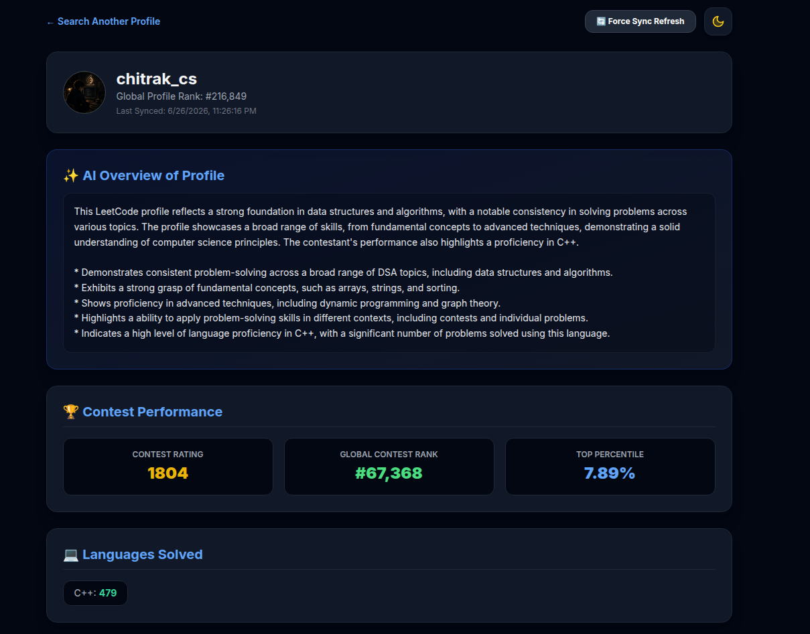
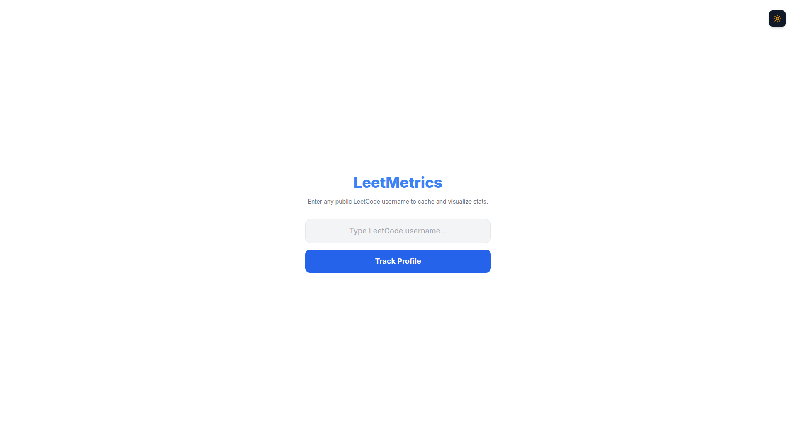
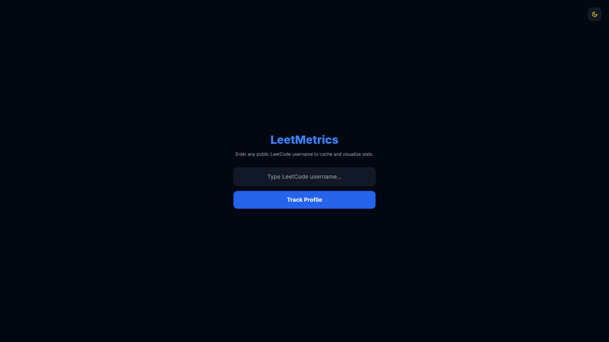
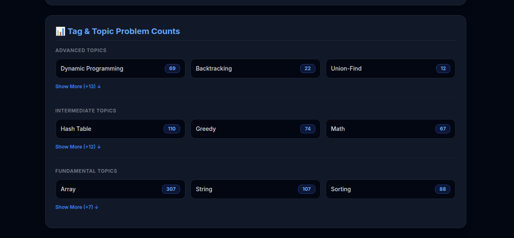

# 📊 LeetMetrics — Open LeetCode Profile Analytics & Dashboard

LeetMetrics is a blazing-fast, AI-powered analytics dashboard built for public LeetCode profiles. It fetches, caches, and visualizes user statistics while generating intelligent portfolio insights using LLMs. Built with **Next.js 14**, **Supabase**, and **Groq AI**, it provides developers with an elegant way to analyze coding progress, contest performance, language usage, and topic mastery.

---

## 🚀 Key Features

* ⚡ **Optimized Supabase Caching** – Lightning-fast profile lookups using PostgreSQL caching.
* 🤖 **AI Portfolio Summary** – Automatically generates resume-friendly coding profile summaries using Groq Llama 3.3.
* 📊 **Advanced Analytics Dashboard** – View solved problems, topic distributions, language statistics, and contest performance.
* 🧠 **Topic Analysis** – Categorizes solved problems into core DSA topics with interactive visualizations.
* 🌙 **Dark & Light Themes** – Beautiful responsive UI with persistent theme switching.
* 🔄 **Real-Time Sync** – Refresh cached data instantly to fetch the latest LeetCode submissions.
* 📱 **Responsive Design** – Optimized for desktop, tablet, and mobile devices.

---

# 📸 Screenshots

## 🏠 Landing Page

<p align="center">
  
</p>

---

## ☀️ Dashboard (Light Mode)

<p align="center">
  
</p>

---

## 🌙 Dashboard (Dark Mode)

<p align="center">
  
</p>

---

## 📈 Statistics Dashboard

<p align="center">
  
</p>

---

# 🛠 Tech Stack

| Category           | Technology                         |
| ------------------ | ---------------------------------- |
| **Framework**      | Next.js 14 (App Router)            |
| **Language**       | TypeScript                         |
| **Styling**        | Tailwind CSS, NextUI               |
| **Database**       | Supabase PostgreSQL                |
| **Authentication** | Supabase Auth                      |
| **AI**             | Groq SDK (Llama 3.3 70B Versatile) |
| **Charts**         | Recharts                           |
| **Icons**          | Lucide React                       |
| **Deployment**     | Vercel                             |

---

# 🏗 Project Structure

```text
LeetMetrics/
│
├── app/
├── components/
├── lib/
├── hooks/
├── public/
├── assets/
│   ├── overview.png
│   ├── Dashboard_light.png
│   ├── Dashboard_black.png
│   └── stats.png
│
├── package.json
└── README.md
```

---

# ⚙️ Local Installation

## 1. Clone the Repository

```bash
git clone https://github.com/soumilibag/LeetMetrics.git
cd LeetMetrics
```

## 2. Install Dependencies

```bash
npm install
```

## 3. Create Environment Variables

Create a `.env.local` file in the project root.

```env
# Supabase
NEXT_PUBLIC_SUPABASE_URL=https://your-project.supabase.co
NEXT_PUBLIC_SUPABASE_ANON_KEY=your_supabase_anon_key

# Groq API
GROQ_API_KEY=your_groq_api_key

NODE_ENV=development
```

## 4. Run the Development Server

```bash
npm run dev
```

Open your browser and visit:

```
http://localhost:3000
```

---

# 🚀 Future Improvements

* [ ] Company-wise problem analysis
* [ ] Daily coding reminders
* [ ] Personalized revision planner
* [ ] Contest prediction insights
* [ ] AI interview preparation mode
* [ ] Export analytics as PDF

---

# 🤝 Contributing

Contributions are welcome!

1. Fork the repository.
2. Create a new feature branch.
3. Commit your changes.
4. Push to your branch.
5. Open a Pull Request.

---

# 📄 License

This project is licensed under the **MIT License**.

---

# 👨‍💻 Author

**Soumili Bag**

GitHub: https://github.com/soumilibag

**Chitrak Betal**

GitHub: https://github.com/chitrak-cs

---

<p align="center">

⭐ If you found this project useful, consider giving it a star!

Made with ❤️ using **Next.js**, **Supabase**, and **Groq AI**.

</p>
