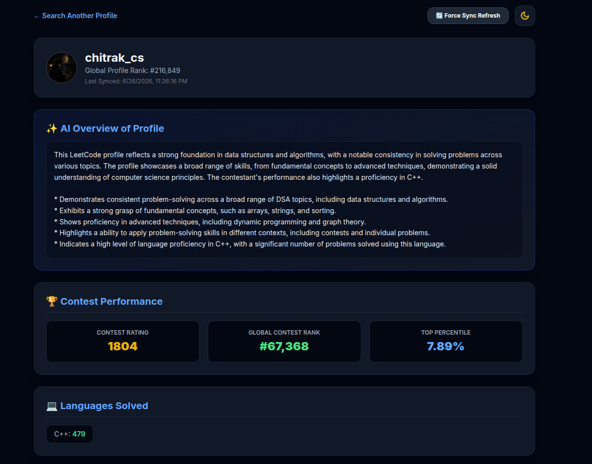
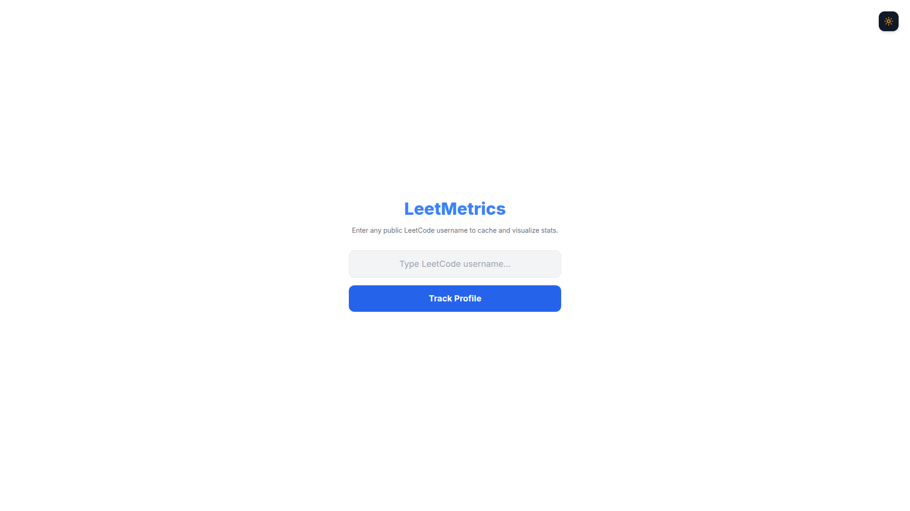
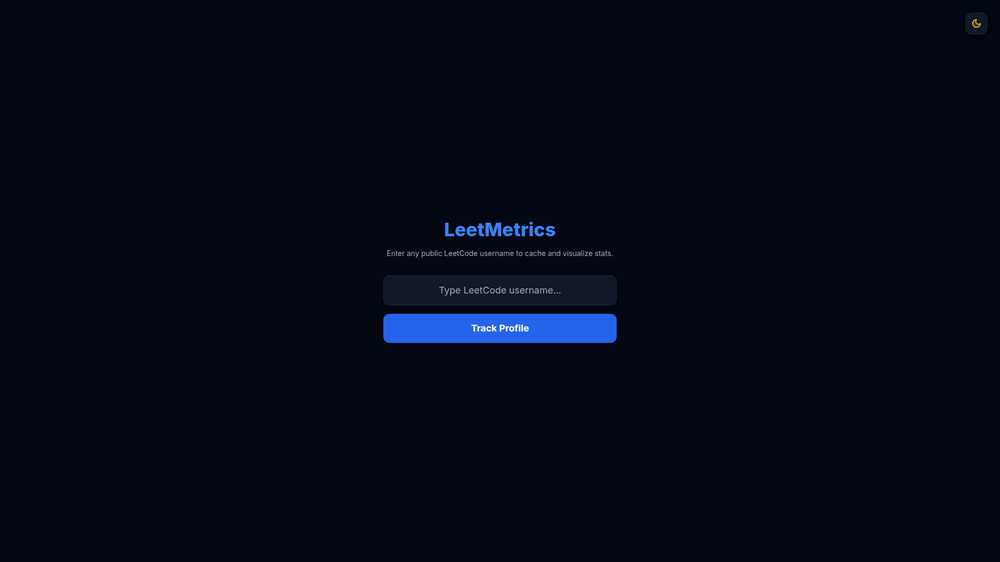
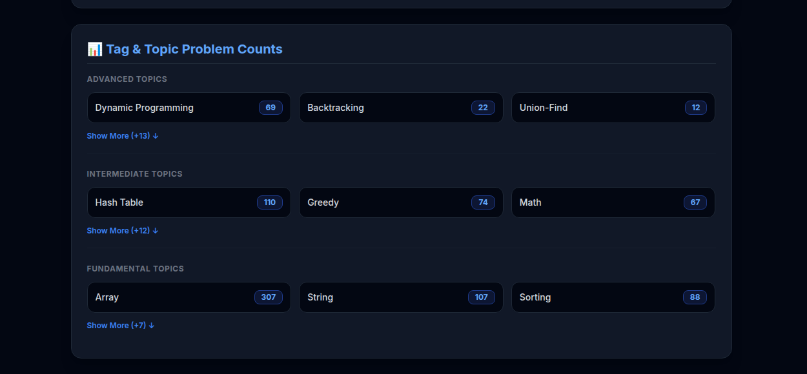

# LeetMetrics

LeetMetrics is an AI-powered analytics dashboard for public LeetCode profiles. Enter a LeetCode username to view profile ranking, contest performance, language usage, topic-wise problem-solving statistics, and an AI-generated portfolio summary.

Built with Next.js, TypeScript, Supabase, and Groq.

## Features

- Search any public LeetCode profile by username.
- Retrieve public profile ranking, avatar, and display name.
- View contest rating, global contest rank, and top percentile.
- Explore solved-problem counts by programming language.
- Explore topic-wise solved-problem counts across fundamental, intermediate, and advanced categories.
- Generate a concise, resume-friendly portfolio summary from the profile statistics.
- Cache profile results in Supabase for faster repeat lookups and fewer external API calls.
- Force-refresh a profile when the latest LeetCode data is needed.
- Use a responsive dark or light interface.

## Screenshots

### Landing Page

<p align="center">
  
</p>

### Dashboard — Light Mode

<p align="center">
  
</p>

### Dashboard — Dark Mode

<p align="center">
  
</p>

### Statistics Dashboard

<p align="center">
  
</p>

## How It Works

```text
User enters a LeetCode username
          |
          v
Next.js frontend sends POST /api/leetcode
          |
          v
Supabase cache lookup
          |
     +----+----+
     |         |
Cache hit   Cache miss or forced refresh
     |         |
     |         v
     |   LeetCode GraphQL API requests
     |         |
     |         v
     |   Groq generates AI portfolio overview
     |         |
     +----> Supabase upsert
                |
                v
          Dashboard renders the result
```

### Data flow

1. The user enters a public LeetCode username on the home page.
2. The frontend calls the Next.js route `POST /api/leetcode`.
3. The route checks Supabase for an existing cached profile record.
4. On a cache miss, or when the user chooses **Force Sync Refresh**, the route retrieves fresh data from LeetCode.
5. Independent LeetCode requests run concurrently to reduce response time.
6. The retrieved metrics are passed to Groq to create a professional portfolio summary.
7. The assembled data is saved in Supabase and returned to the frontend.
8. The dashboard stores the response in browser session storage and presents the analytics.

## LeetCode Data Source

LeetMetrics retrieves public profile data through LeetCode's GraphQL endpoint:

```text
https://leetcode.com/graphql
```

The application requests the following public data:

| Metric | Purpose |
| --- | --- |
| Public profile | Username, real name, avatar, and global ranking |
| Contest ranking | Contest count, rating, global rank, participant count, and percentile |
| Topic statistics | Solved counts for fundamental, intermediate, and advanced tags |
| Language statistics | Number of solved problems by language |
| Recent accepted submissions | The latest 10 accepted submissions |
| Submission calendar | Current-year submission activity calendar |

> **Note:** This app relies on LeetCode's GraphQL endpoint for public-profile information. Its schema or availability may change, so production deployments should include monitoring, retries, caching, and rate limiting.

## AI Summary

The application uses the Groq SDK with the model below:

```text
qwen/qwen3.8-27b
```

The model is used for inference only; LeetMetrics does not train or fine-tune an AI model. It receives a structured snapshot of public profile metrics and produces a concise, professional summary suitable for a portfolio or resume.

The prompt asks the model to:

- Base statements on the supplied profile data.
- Highlight consistency, topic coverage, language proficiency, and contest performance when supported.
- Avoid exaggerated claims and improvement recommendations.
- Keep the result under 180 words.

The model uses a low temperature (`0.3`) to keep the output consistent and professional.

## Tech Stack

| Area | Technology |
| --- | --- |
| Framework | Next.js 14 with App Router |
| Language | TypeScript |
| UI | React, Tailwind CSS, NextUI |
| Theme support | next-themes |
| Database and cache | Supabase PostgreSQL |
| AI inference | Groq SDK with `qwen/qwen3.8-27b` |
| Icons | Lucide React |
| Deployment target | Vercel |

## Project Structure

```text
LeetMetrics/
├── app/
│   ├── api/leetcode/route.ts     # Server route: cache, LeetCode, and Groq workflow
│   ├── data/page.tsx             # Analytics dashboard
│   ├── page.tsx                  # Username search page
│   ├── layout.tsx                # Root layout
│   └── providers.tsx             # UI and theme providers
├── components/
│   └── ThemeSwitcher.tsx         # Dark/light theme switcher
├── lib/
│   ├── groq-api.ts               # AI summary generation
│   └── supabase.ts               # Supabase client and helpers
├── supabase/migrations/          # Database schema migrations
├── types/                        # TypeScript data interfaces
└── README.md
```

## Local Setup

### 1. Clone the repository

```bash
git clone https://github.com/soumilibag/LeetMetrics.git
cd LeetMetrics
```

### 2. Install dependencies

```bash
npm install --legacy-peer-deps
```

### 3. Configure environment variables

Create a `.env.local` file in the project root:

```env
NEXT_PUBLIC_SUPABASE_URL=https://your-project.supabase.co
NEXT_PUBLIC_SUPABASE_ANON_KEY=your_supabase_anon_key
GROQ_API_KEY=your_groq_api_key
```

Never commit `.env.local` or any API key to GitHub.

### 4. Configure Supabase

1. Create a Supabase project.
2. Add the environment values from the Supabase project settings.
3. Run the SQL migrations in `supabase/migrations`.
4. Create and secure the `leetcode_cache` table used by `app/api/leetcode/route.ts`, with `leetcode_username` as a unique key.

### 5. Run the app

```bash
npm run dev
```

Open [http://localhost:3000](http://localhost:3000).

## Caching Strategy

LeetCode and AI calls are more expensive than a database read. LeetMetrics first checks Supabase for a cached record using the normalized LeetCode username.

- A normal search returns cached data when available.
- **Force Sync Refresh** bypasses the cache and fetches fresh LeetCode statistics.
- Fresh results replace the existing cached profile through an upsert operation.

For a production version, a cache expiration policy and rate limiting should be added to prevent stale data and control external API usage.

## Future Improvements

- Add a visible submission-calendar heatmap.
- Show recent accepted submissions in the dashboard.
- Add cache expiry and background refresh.
- Add username validation, API rate limiting, and retry handling.
- Validate AI output and provide a deterministic fallback summary.
- Add charts for progress and language/topic distribution.
- Add personalized authenticated dashboards and spaced-repetition review workflows.
- Export analytics as a PDF portfolio report.

## Interview Summary

LeetMetrics separates responsibilities clearly:

- **LeetCode** is the source of public coding-profile facts.
- **Next.js** coordinates the browser, server route, external requests, and dashboard.
- **Supabase** stores and returns cached analytics.
- **Groq and Qwen** transform structured facts into a readable professional summary.

The main design goal is to make public LeetCode progress easy to understand while minimizing repeated calls to external services.

## Author

Soumili Bag  
GitHub: [@soumilibag](https://github.com/soumilibag)

Chitrak Betal  
GitHub: [@chitrak-cs](https://github.com/chitrak-cs)
